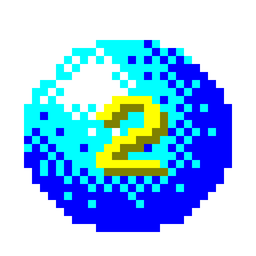

 
# Ball 2 Remake

## Trailer

https://www.youtube.com/watch?v=72-gRQAK_SU

## How to play
The remake is accessible here: https://ball2.warze.org/

Use the left and right arrow keys to move the ball. The goal is to collect all the diamonds.

Hold space to perform a small jump.

## About
An open source remake of the game Ball 2, which was made for Windows XP and abandoned.

Credit to [garf](https://github.com/giorgi765) for finding the original game and extracting the logo.

The original game can be found in the directory "original", to preserve it.

	

